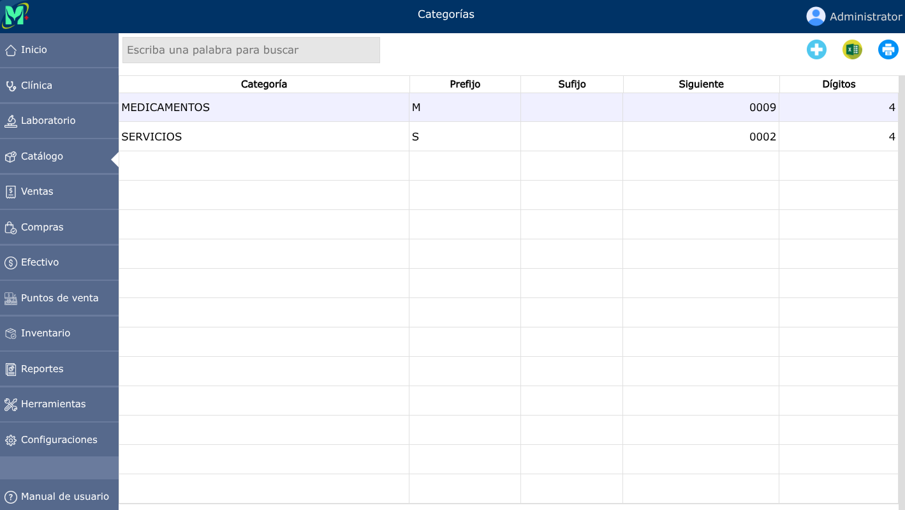
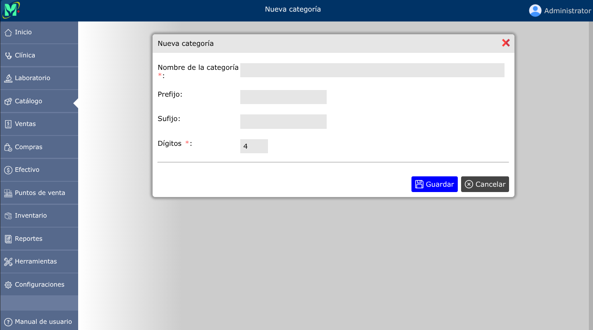
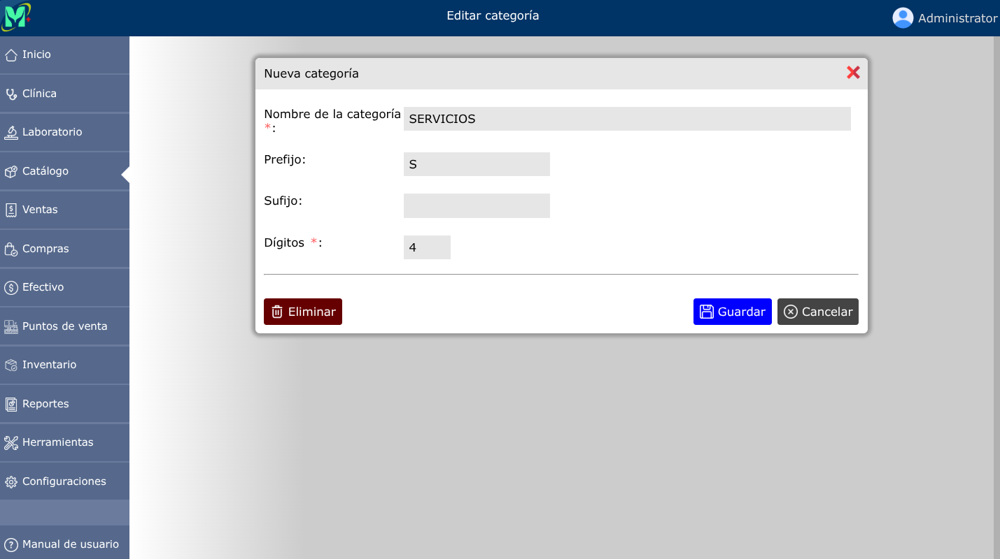

# Categorías

Las categorías permiten clasificar productos y servicios que brinda la empresa; así como también, codificarlos de manera unívoca.

---

## Lista de categorías

Para ver la lista de categorías, vaya a **Catálogo > Categorías**.

---

## Crear una categoría

Para crear una nueva categoría, vaya a: **Catálogo > Categorías**, y luego dar clic en el botón **+**.

---

### Prefijo y sufijo

Las categorías permiten codificar de manera automática cada producto ingresado con un número correlativo. Este número correlativo tiene un ancho fijo, y puede llevar información adicional tanto antes como después del número. La información incluida antes del número correlativo se conoce como prefijo, y la incluída después, es el sufijo. Veamos unos ejemplos a continuación:

*Códigos de 4 dígitos sin prefijo ni sufijo:*  
> 0001  
> 0002  
> 0003...

*Códigos de 4 dígitos con prefijo K:*
> K001  
> K002  
> K003...

*Códigos de 4 dígitos con sufijo L:*
> 001L  
> 002L  
> 003L...

*Códigos de 4 dígitos con prefijo K y sufijo L:*
> K001L  
> K002L  
> K003L...

---

## Modificar una categoría

Para modificar una categoría, vaya a: **Catálogo > Categorías**, luego dar clic en el nombre de la categoría que desea modificar y se abrirá la vista detallada de la categoría, y al pie de esa vista, haga clic en el botón **Editar**.

---

## Eliminar una categoría

Para eliminar una categoría, vaya a: **Catálogo > Categorías**, luego dar clic en el nombre de la categoría que desea eliminar y se abrirá la vista detallada de la categoría, y al pie de esa vista, haga clic en el botón **Eliminar**.

