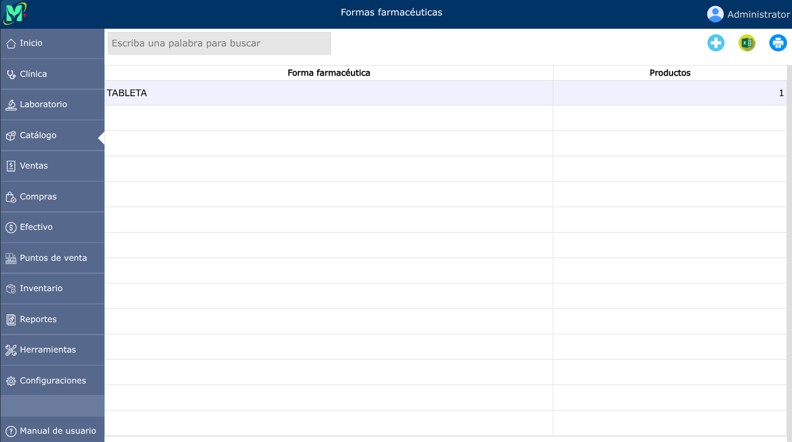
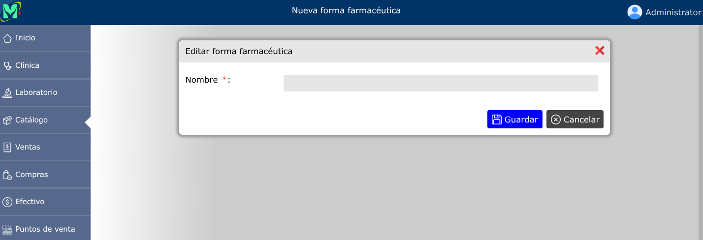
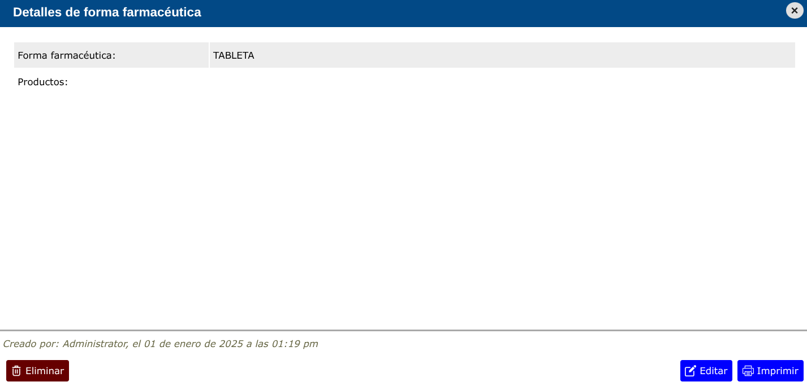

# Formas farmacéuticas

Presentación física de un medicamento (ejemplo: cápsula, jarabe, inyectable) que determina su vía de administración.

---

## Lista de formas farmacéuticas

Para ver la lista de formas farmacéuticas, vaya a: **Catálogo > Formas farmacéuticas**.

---

## Nueva forma farmacéutica

Para crear una nueva forma farmacéutica, vaya a: **Catálogo > Formas farmacéuticas**, y luego dar clic en el botón **+**.

---

## Editar forma farmacéutica

Para editar una forma farmacéutica, vaya a: **Catálogo > Formas farmacéuticas**, luego dar clic en la forma farmacéutica que desea editar y se abrirá la vista detallada de la forma farmacéutica, y al pie de esa vista, haga clic en el botón **Editar**.

---

## Eliminar forma farmacéutica

Para eliminar una forma farmacéutica, vaya a: **Catálogo > Formas farmacéuticas**, luego dar clic en la forma farmacéutica que desea eliminar y se abrirá la vista detallada de la forma farmacéutica, y al pie de esa vista, haga clic en el botón **Eliminar**.

