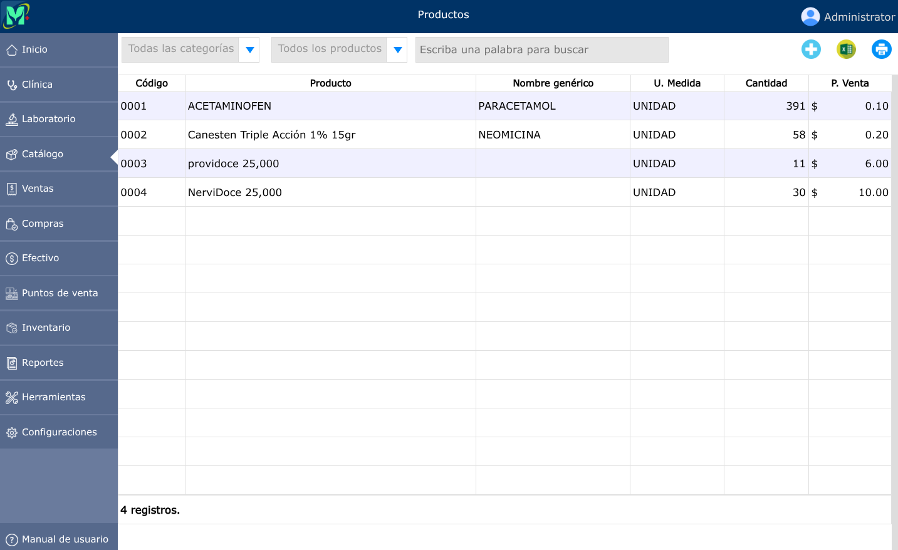
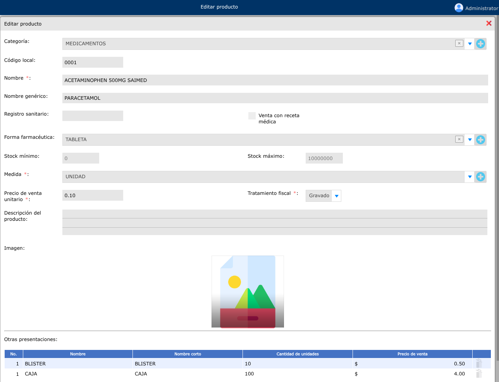
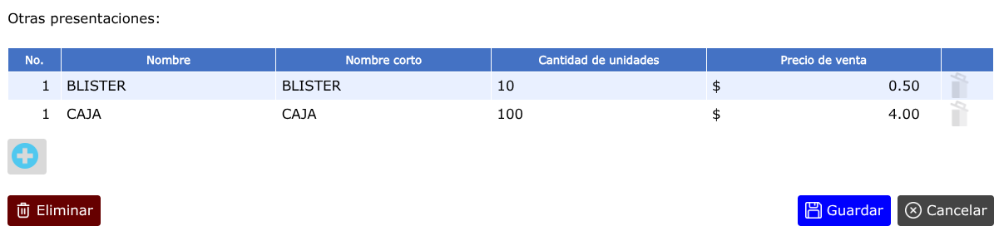
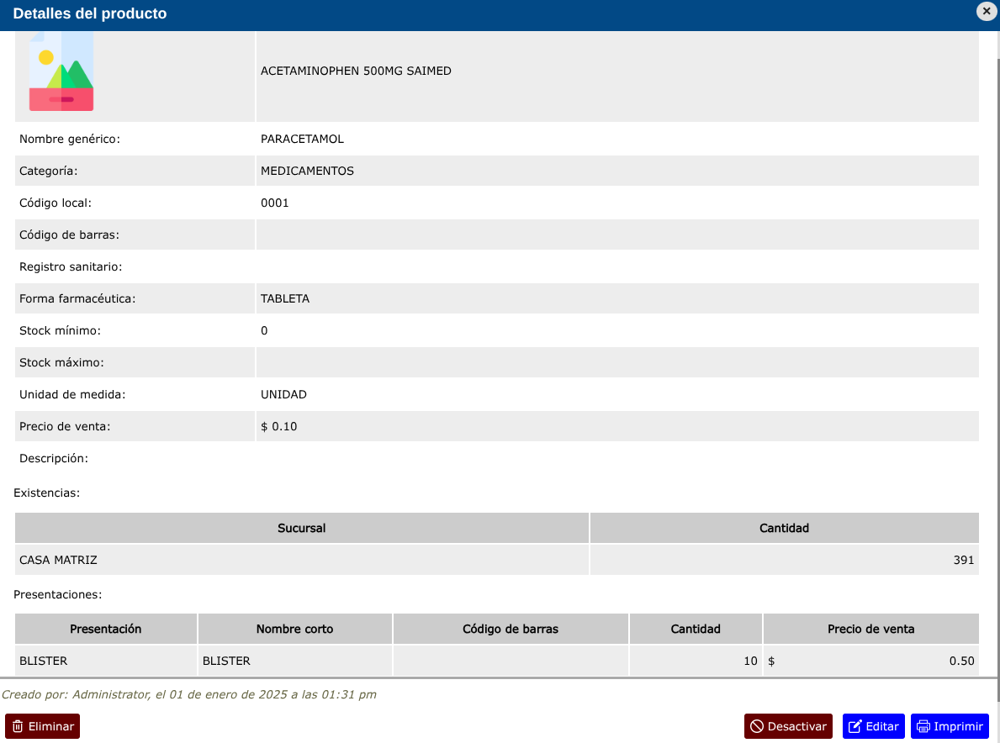
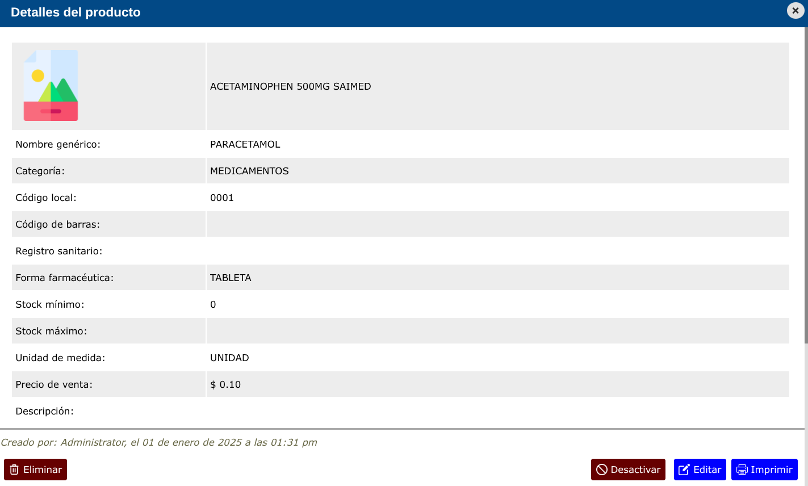

# Productos

Los productos son cada uno de los bienes de compraventa que tienen efecto directo en el inventario físico de la empresa. Los productos pueden dividirse en [categorías](categorias.md).

---

## Lista de productos

Para ver la lista de productos, vaya a: **Catálogo > Productos**.

En el listado de productos podrá filtrar los productos por categorías.  
Filtrar cuales productos tienen existencia, agotados o desactivados, esto se podrá observar si ya se ha hecho el respectivo levantamiento de inventario.

---

## Registrar un nuevo producto

Para registrar un producto, vaya a: **Catálogo > Productos**, y luego dar clic en el botón **+**.

### Unidades de medida de los productos

La unidad de medida de los productos corresponde a la forma básica de presentación de los mismos, por lo que se recomienda registrar la unidad más pequeña razonable. Por ejemplo, para un producto que se vende por libras, arrobas y quintales, la unidad básica de medida es libra.

Puede ver más información en la sección: [unidades de medida](unidades-medida.md).

---

### Presentaciones de los productos

Las presentaciones son las distintas formas o cantidades en las que se venden los productos además de su unidad básica. Por ejemplo, un producto podría venderse por unidad, por docena, por caja y por ciento, usando el mismo código local. Asimismo, en cada una de las presentaciones podrían tener precios diferentes a la suma de las unidades. Considere, por ejemplo, un producto que se vende por unidad a \$1.00, pero que por docena se vende a \$10.00.

---

## Vista detallada de los productos

Para ver la vista detallada de un producto, vaya a: **Catálogo > Productos**, luego dar clic en el nombre de el producto que desea ver el detalle.

En la vista detallada del producto se mostrarán todos los datos registrados acerca del producto, la existencia y su ubicación, y las diferentes presentaciones del producto.

Al pie de la vista, podrá ver información acerca del usuario, fecha y hora de creación y última modificación del producto.

---

## Modificar un producto

Para modificar un producto, vaya a: **Catálogo > Productos**, luego dar clic en el producto que desea modificar y se abrirá la vista detallada del producto, y al pie de esa vista, haga clic en el botón **Editar**.

---

## Eliminar un producto

Para eliminar un producto, vaya a: **Catálogo > Productos**, luego dar clic en el producto que desea eliminar y se abrirá la vista detallada del producto, y al pie de esa vista, haga clic en el botón **Eliminar**.

> **Nota**: Los productos eliminados ya no aparecerán en los elementos facturables a la hora de crear una venta; pero seguirán apareciendo en el detalle de ventas, cotizaciones, compras, traslado de productos y mermas previamente registradas.
