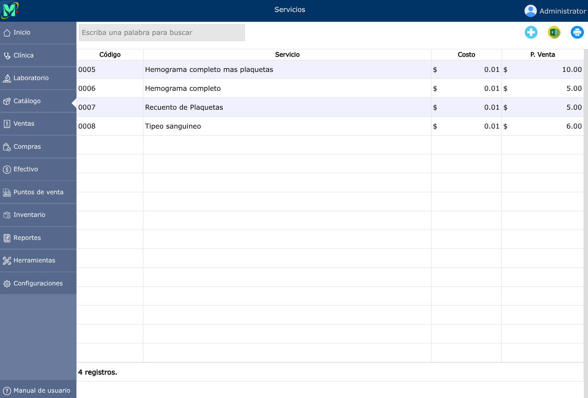
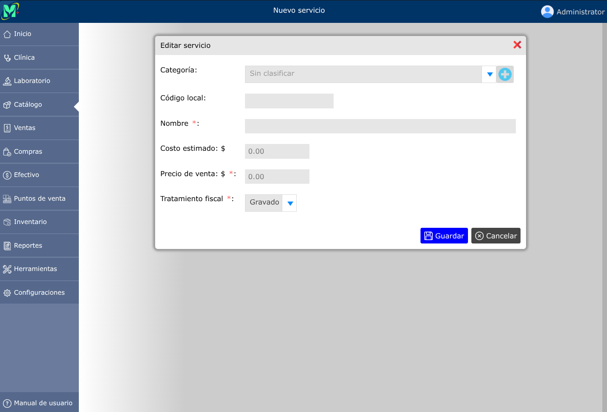
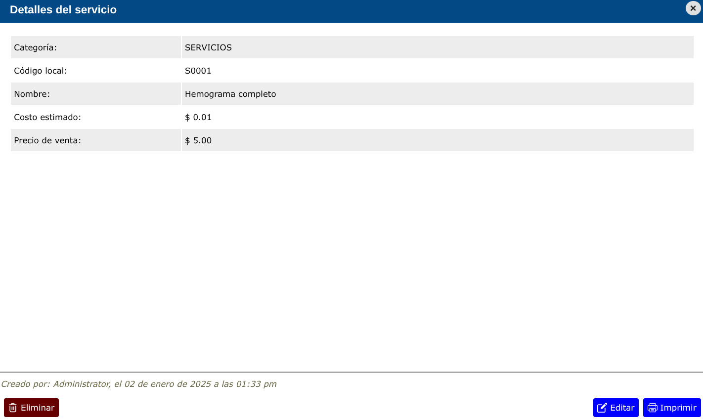

# Servicios

Los servicios son todos los elementos comercializables de la empresa, que no afectan las existencias de inventario, tales como: transporte, asesorías, instalaciones, entre otros.

---

## Lista de servicios

Para ver la lista de servicios, vaya a: **Catálogo > Servicios**.

---

## Crear un servicio

Para crear un servicio, vaya a: **Catálogo > Servicios**, y luego dar clic en el botón **+**.

Aparecerá un formulario en donde deberá registrar el nombre del servicio, el costo estimado, y el precio de venta.

---

## Modificar un servicio

Para modificar los datos de un servicio, vaya a: **Catálogo > Servicios**, luego dar clic en el servicio que desea modificar y se abrirá la vista detallada del servicio, y al pie de esa vista, haga clic en el botón **Editar**.

Aparecerá un formulario con los datos del servicio. Proceda a modificar los campos que desee, y a continuación, haga clic en **Guardar**.

---

## Eliminar un servicio

Para eliminar un servicio, vaya a: **Catálogo > Servicios**, luego dar clic en el servicio que desea eliminar y se abrirá la vista detallada del servicio, y al pie de esa vista, haga clic en el botón **Eliminar**.

> **Nota**: Los servicios eliminados no aparecerán en la lista de servicios, ni en la lista de elementos facturables del formulario de venta ni del formulario de cotización. No obstante, sí seguirán apareciendo en los detalles de venta o cotización que hayan sido creados antes de eliminar el servicio.
