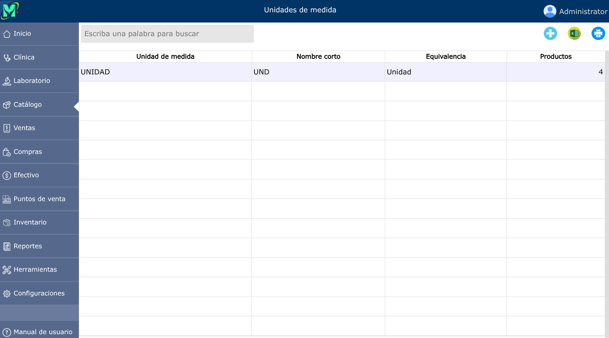
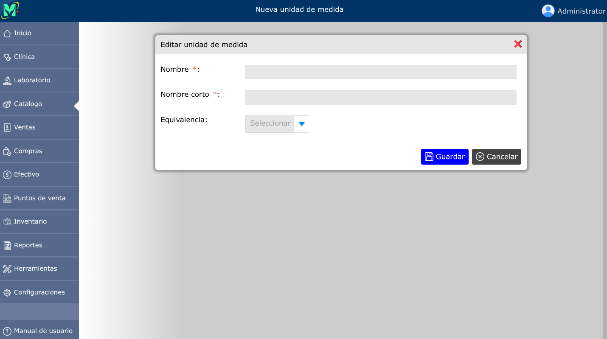
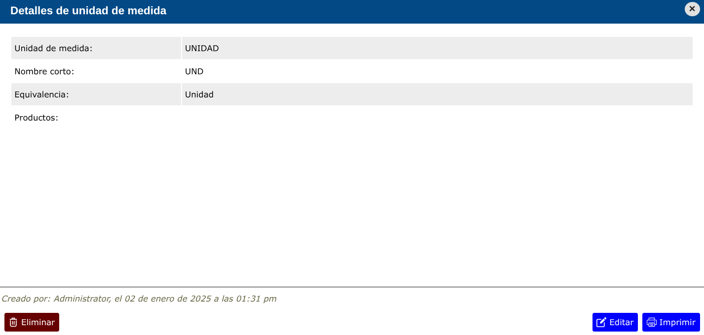

# Unidades de medida

Las unidades de medida permiten definir la forma básica de presentación de los productos. En este sistema, las unidades de medida pueden registrarse de forma libre, sin clasificación alguna.

---

## Lista de unidades de medida

Para ver la lista de unidades de medida, vaya a: **Catálogo > Unidades de medida**.

---

## Nueva unidad de medida

Para crear una nueva unidad de medida, vaya a: **Catálogo > Unidades de medida**, y luego dar clic en el botón **+**.

---

## Editar unidad de medida

Para modificar una unidad de medida, vaya a: **Catálogo > Unidades de medida**, luego dar clic en la unidad de medida que desea modificar y se abrirá la vista detallada de la unidad de medida, y al pie de esa vista, haga clic en el botón **Editar**.

---

## Eliminar unidad de medida

Para eliminar una unidad de medida, vaya a: **Catálogo > Unidades de medida**, luego dar clic en la unidad de medida que desea eliminar y se abrirá la vista detallada de la unidad de medida, y al pie de esa vista, haga clic en el botón **Eliminar**.

