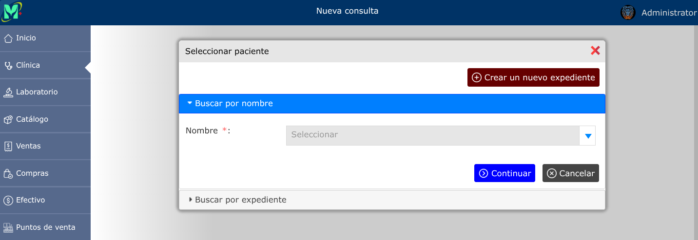
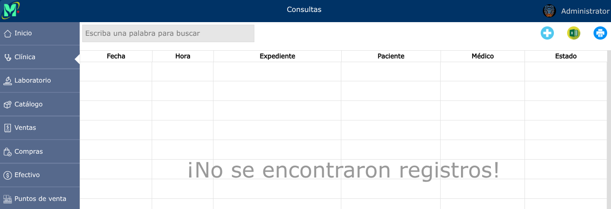
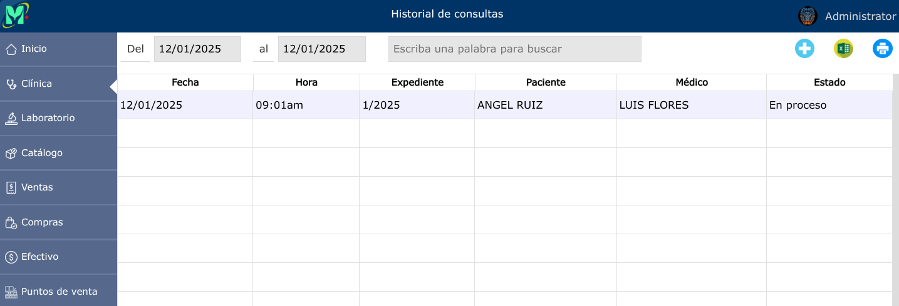
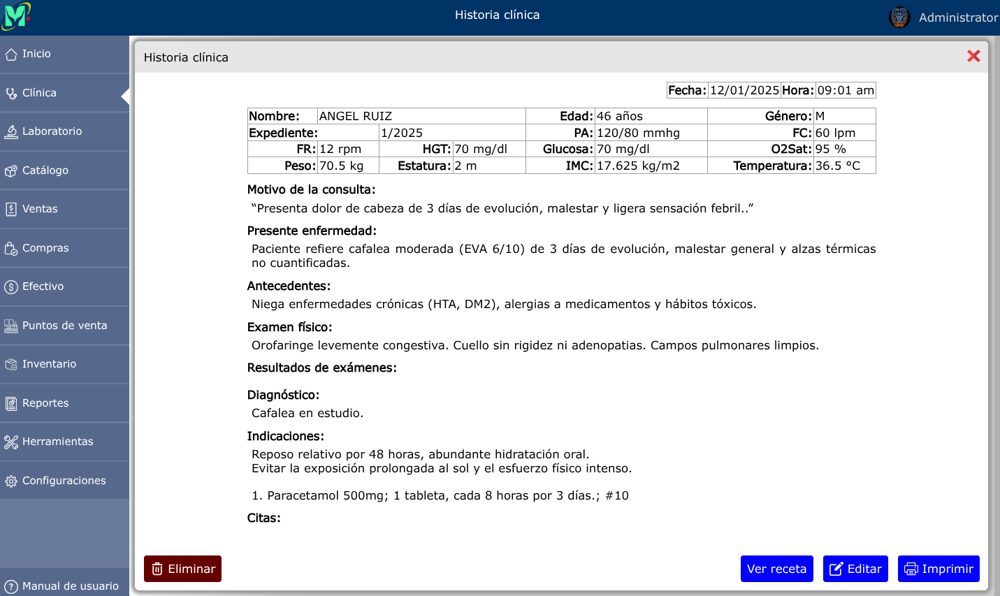

# Consultas médicas

---

## Registrar nueva consulta

Para registrar una nueva consulta, vaya a: **Clínica > Nueva consulta**.

---

### Consultas en dos pasos

El registro en el formulario de consulta puede hacerse en dos pasos, o en una sola operación, dependiendo de la configuración que se haya dejado en [Preferencias](../configuraciones/preferencias.md). Por defecto, el sistema está configurado para registrar las consultas en dos pasos:  
**El primer paso**: Con la información general del paciente, y opcionalmente, la toma de signos vitales.  
**El segundo paso**: Con todos los demás datos de la consulta.

### El primer paso

### El segundo paso

---

## Consultas en proceso

Para ver las consultas en proceso, vaya a: **Clínica > Consultas en proceso**.

---

## Historial de consultas

Para ver el historial de consultas, vaya a: **Clínica > Historial de consultas**.

Para registrar una nueva consulta desde el historial de consultas, dar clic en el botón **+**.

---

### Editar consulta

Para editar una consulta, vaya a: **Clínica > Historial de consultas**, luego dar clic en el nombre de la consulta que desea editar y se abrirá la vista detallada de la consulta, y al pie de esa vista, haga clic en el botón **Editar**.

---

### Eliminar consulta

Para eliminar una consulta, vaya a: **Clínica > Historial de consultas**, luego dar clic en el nombre de la consulta que desea eliminar y se abrirá la vista detallada de la consulta, y al pie de esa vista, haga clic en el botón **Eliminar**.

