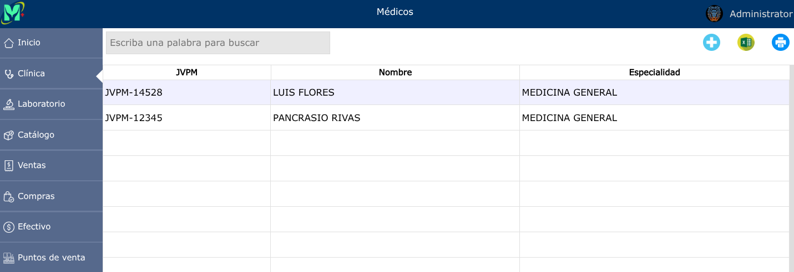
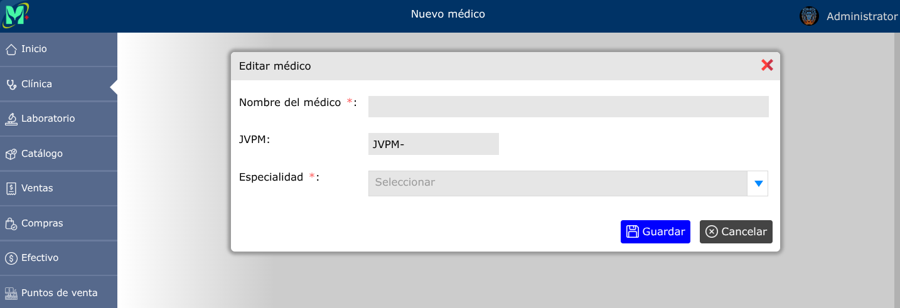
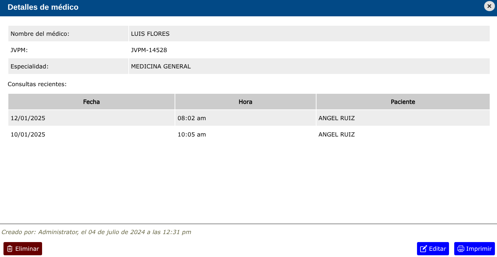

# Médicos

---

## Listado de médicos

Para ver el listado de médicos, vaya a: **Clínica > Médicos**.

---

## Registrar nuevo médico

Para registrar un nuevo médico, vaya a: **Clínica > Médicos**, y luego dar clic en el botón **+**.

---

## Editar médico

Para editar un médico, vaya a: **Clínica > Médicos**, luego dar clic en el nombre de el médico que desea editar y se abrirá la vista detallada de el médico, y al pie de esa vista, haga clic en el botón **Editar**.

---

## Eliminar médico

Para eliminar un médico, vaya a: **Clínica > Médicos**, luego dar clic en el nombre de el médico que desea eliminar y se abrirá la vista detallada de el médico, y al pie de esa vista, haga clic en el botón **Eliminar**.

