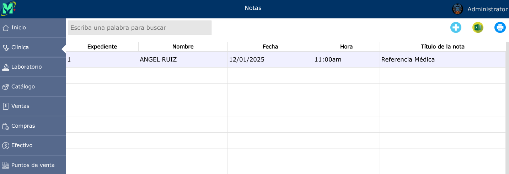
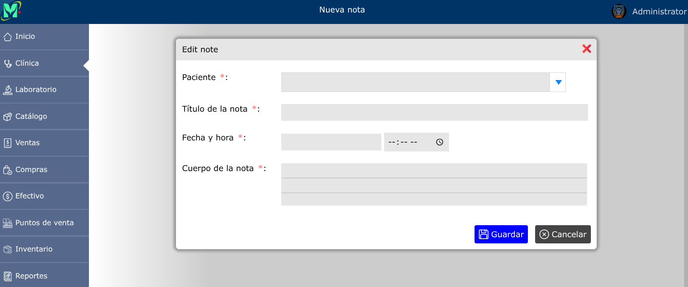
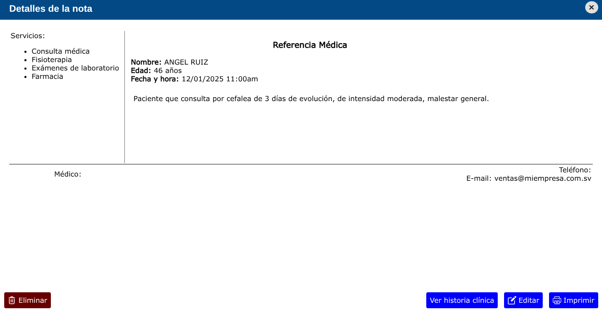

# Notas

El módulo de notas le permite registrar diversos documentos que aún no están contenplados en los formatos proporcionados por el sistema.

---

## Lista de notas

Para ver la lista de notas, vaya a: **Clínica > Notas**.

---

## Registrar nota

Para registrar una nueva nota, vaya a: **Cínica > Notas**, y luego dar clic en el botón **+**.

---

## Editar nota

Para editar una nota, vaya a: **Clínica > Notas**, luego dar clic en el nombre de la nota que desea editar y se abrirá la vista detallada de la nota, y al pie de esa vista, haga clic en el botón **Editar**.

---

## Eliminar nota

Para eliminar una nota, vaya a: **Clínica > Notas**, luego dar clic en el nombre de la nota que desea eliminar y se abrirá la vista detallada de la nota, y al pie de esa vista, haga clic en el botón **Eliminar**.

