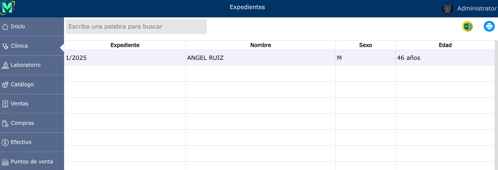

# Pacientes

Los pacientes son las personas registradas en el sistema que reciben atención médica y poseen un historial clínico asociado.

---

## Listado de pacientes

Para ver el listado de pacientes, vaya a: **Clínica > Pacientes**.

