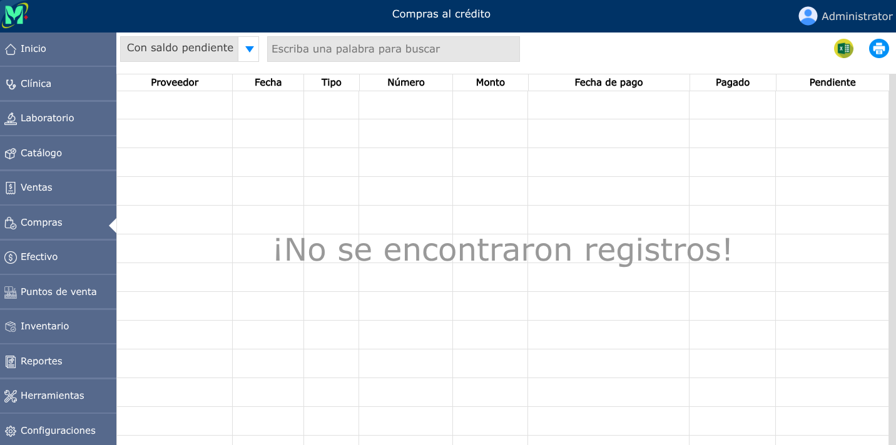

# Compras al crédito

Adquisición de bienes o servicios cuyo pago se difiere a una fecha futura según los términos o plazos acordados con el proveedor.

---

## Lista de compras al crédito

Para ver la lista de compras al crédito, vaya a: **Compras > Compras al crédito**.

