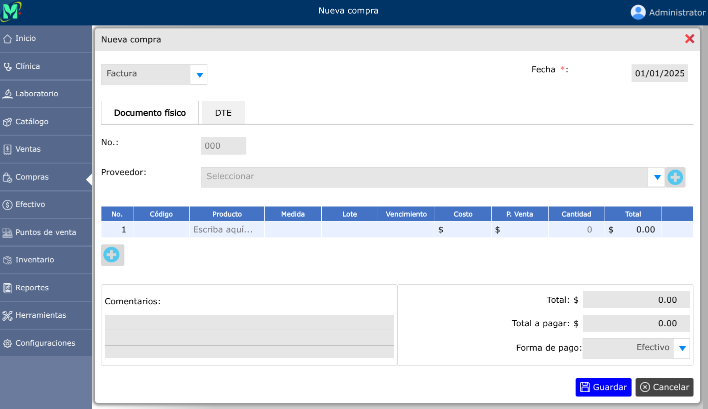
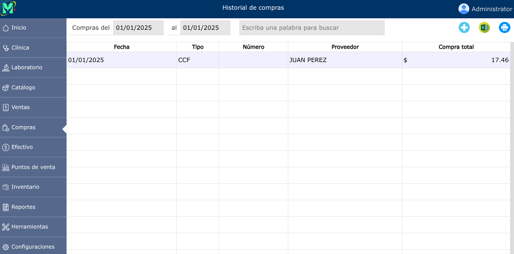
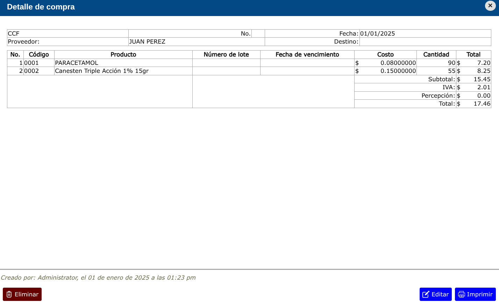

# Compras

En este módulo se registrarán las compras de productos que la empresa pondrá a la venta.

---

## Nueva compra

Antes de registrar una compra, es necesario que todos los productos estén previamente registrados en el [catálogo de productos](../catalogo/productos.md).

---

Para registrar una nueva compra, vaya a: **Compras > Nueva compra**.

También podrá registrar una nueva compra, desde el historial de compras, para ello, vaya a: **Compras > Historial de compras** y luego dar clic en el botón **+**.

Se abrirá un formulario que consta con una serie de opciones:

**Tipo de documento**: Un selector le permitirá elegir el tipo de documento que el proveedor emitió al momento de la compra.  
**Número de documento**: En el espacio correspondiente digite el número de documento recibido.  
**Proveedor**: En el selector, puede elegir un proveedor previamente registrado en el sistema. En caso de que el proveedor aún no esté registrado, entonces, haga clic en **Nuevo proveedor**, y aparecerá un cuadro de diálogo en donde podrá registrar la información de ese proveedor.

---

## Historial de compras

Para ver el historial de compras, vaya a: **Compras > Historial de compras**.

---

### Editar compra

Las compras se pueden editar si aún no se ha vendido ningún producto.

Para poder editar una compra, vaya a: **Compras > Historial de compras**, luego dar clic en la compra que desea editar y se mostrará una vista en donde podrá observar la opción **Editar**.

---

### Eliminar compra

Para poder eliminar una compra, vaya a: **Compras > Historial de compras**, luego dar clic en la compra que desea eliminar y se mostrará una vista en donde podrá observar la opción **Eliminar**.

