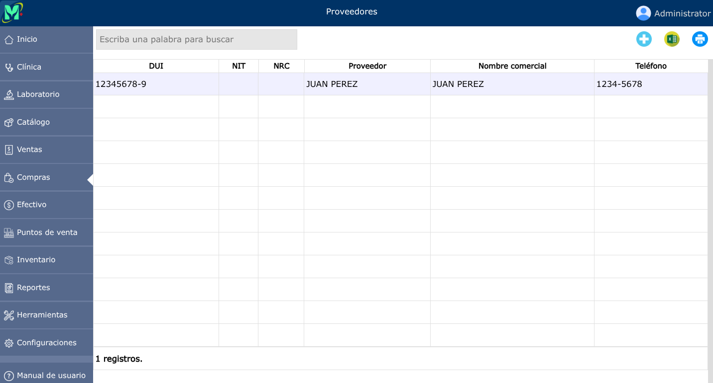
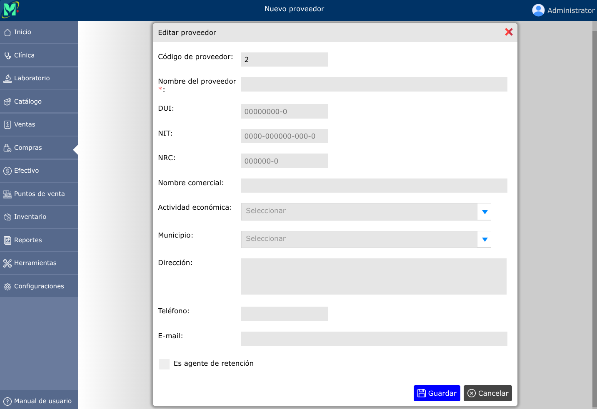
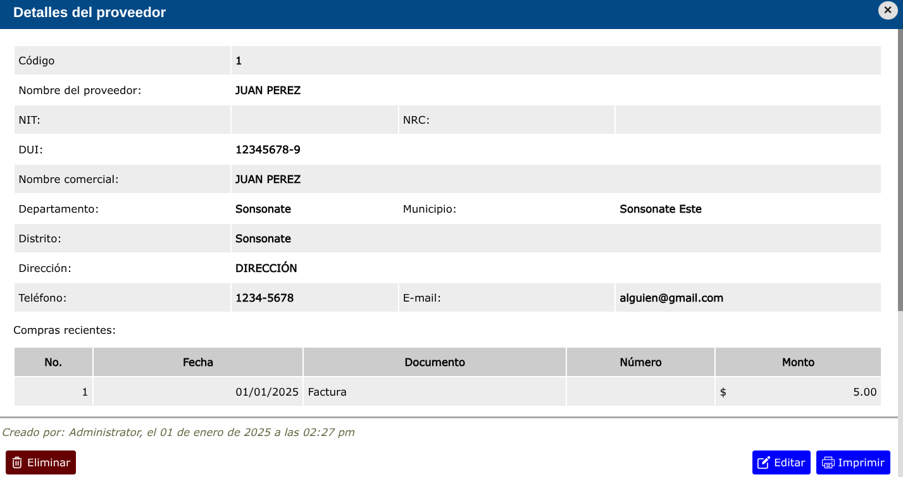

# Proveedores

Los proveedores son las personas naturales o jurídicas que suministran productos a la empresa.

---

## Lista de proveedores

Para ver la lista de proveedores, vaya a: **Compras > Proveedores**.

---

## Registrar un nuevo proveedor

Para registrar un nuevo proveedor, vaya a: **Compras > Proveedores**, y luego dar clic en el botón **+**.

---

## Editar proveedor

Para editar un proveedor, vaya a: **Compras > Proveedores**, luego dar clic en el nombre de el proveedor que desea editar y se abrirá la vista detallada del proveedor, y al pie de esa vista, haga clic en el botón **Editar**.

---

## Eliminar proveedor

Para eliminar un proveedor, vaya a: **Compras > Proveedores**, luego dar clic en el nombre de el proveedor que desea eliminar y se abrirá la vista detallada del proveedor, y al pie de esa vista, haga clic en el botón **Eliminar**.

