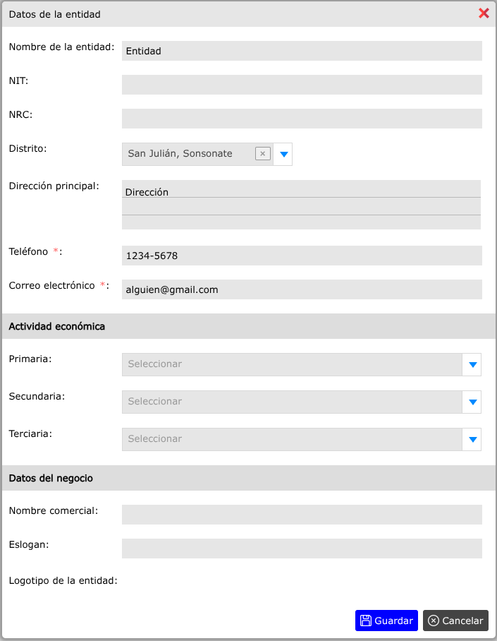

# Datos de la entidad

Una entidad es la persona, empresa u organización que hace uso del sistema.

---

## Modificar datos de la entidad

Para modificar los datos de la entidad, vaya a: **Configuraciones > Datos de la entidad**, al haber modificado los datos dar clic en el botón **Guardar**.

