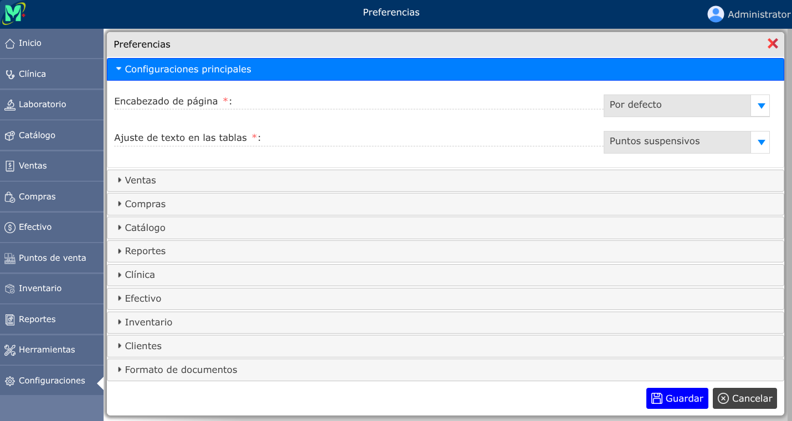
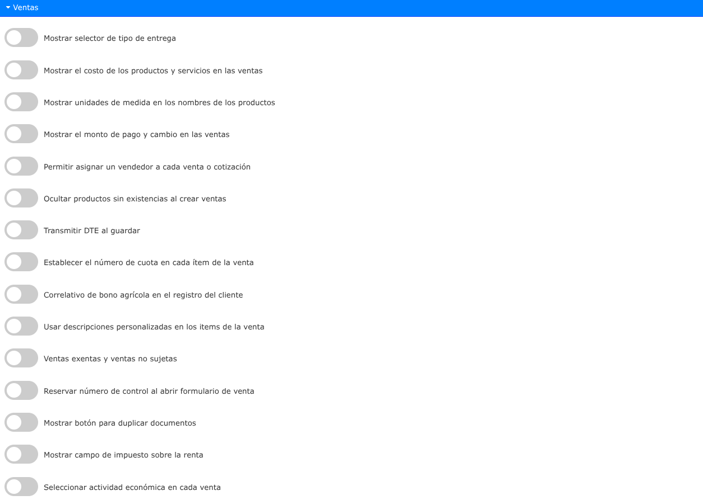
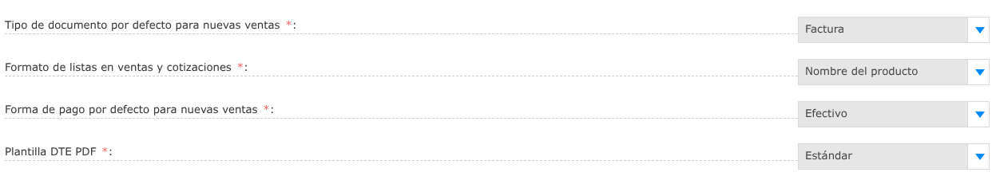
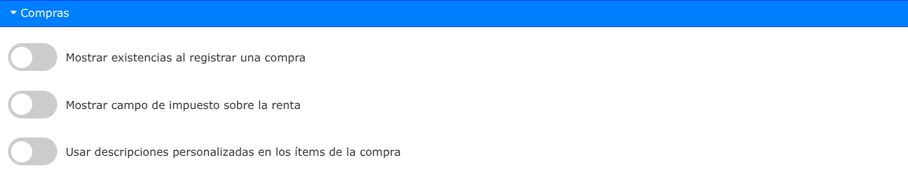
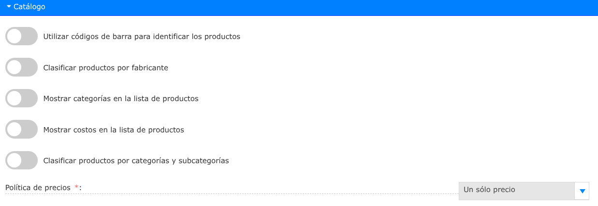
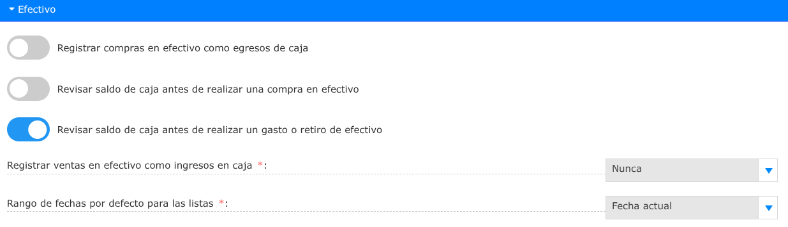
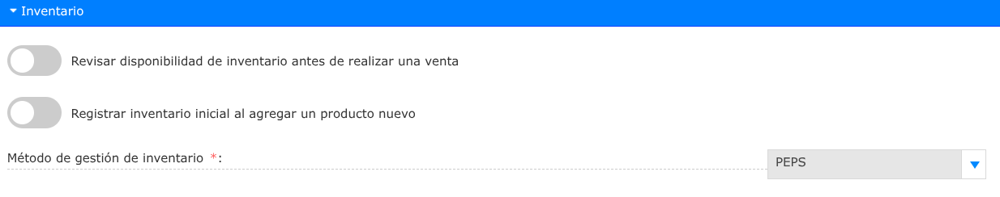
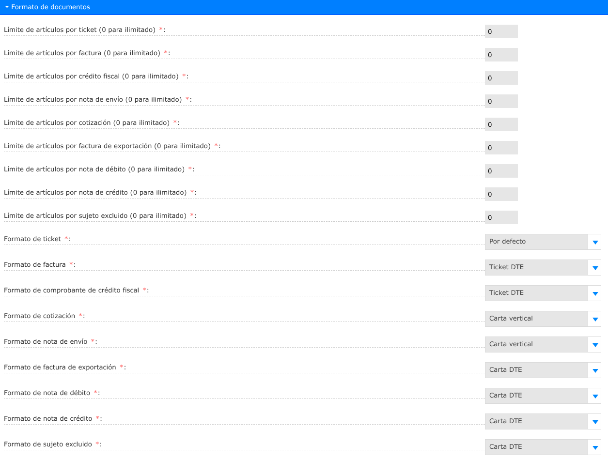

# Preferencias

Las preferencias son configuraciones en el comportamiento de los distintos módulos del sistema para adaptarlo a sus propias necesidades.

---

## Lista de preferencias

Para ver la lista de preferencias, vaya a: **Configuraciones > Preferencias**.

---

### Configuraciones en ventas

---

### Configuraciones en compras

---

### Configuraciones en catálogo

---

### Configuraciones en reportes

---

### Configuraciones en clínica

---

### Configuraciones en efectivo

---

### Configuraciones en inventario

---

### Configuraciones en clientes

---

### Configuraciones en formatos de documentos

