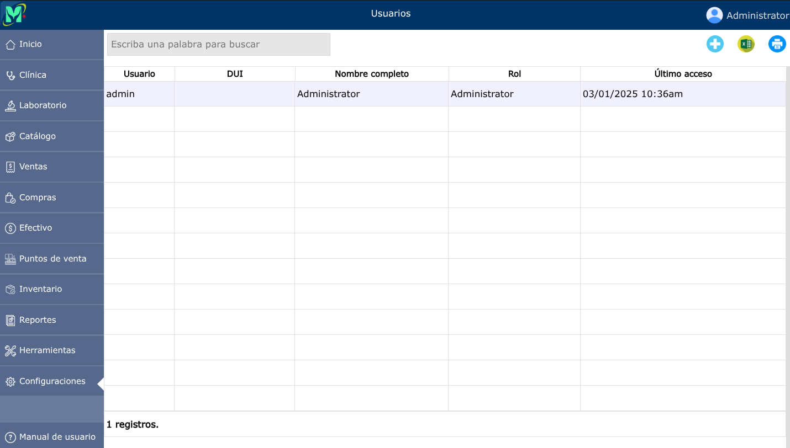
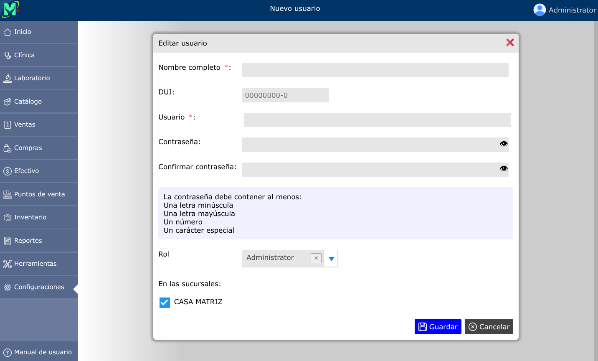
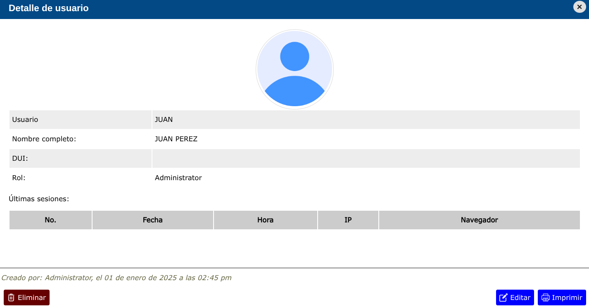

# Usuarios

Los usuarios son cada una de las personas con credenciales de acceso *(usuario y contraseña)* y determinado número de permisos en el sistema.

---

## Lista de usuarios

Para ver la lista de usuarios, vaya a: **Configuraciones > Usuarios**.

---

## Nuevo usuario

Para crear un nuevo usuario, vaya a: **Configuraciones > Usuarios**, y luego dar clic en el botón **+**.

---

## Editar usuario

Para editar un usuario, vaya a: **Configuraciones > Usuarios**, luego dar clic en el nombre de el usuario que desea editar y se abrirá la vista detallada de el usuario, y al pie de esa vista, haga clic en el botón **Editar**.

---

## Eliminar usuario

Para eliminar un usuario, vaya a: **Configuraciones > Usuarios**, luego dar clic en el nombre de el usuario que desea eliminar y se abrirá la vista detallada de el usuario, y al pie de esa vista, haga clic en el botón **Eliminar**.

