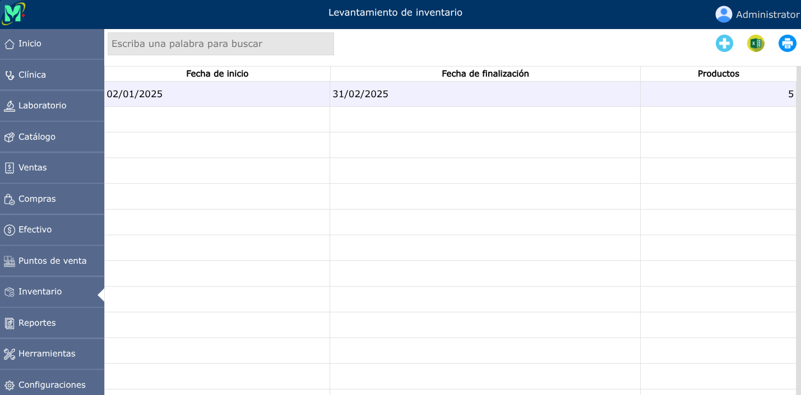
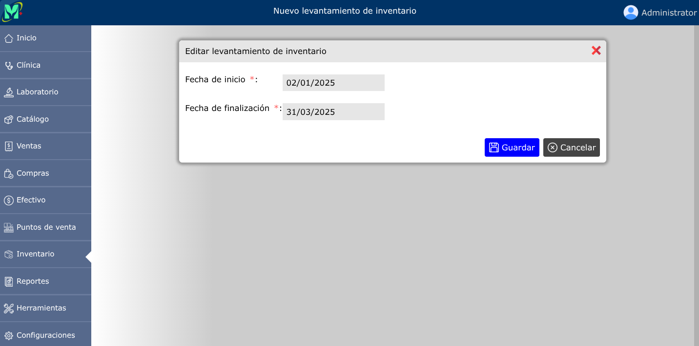
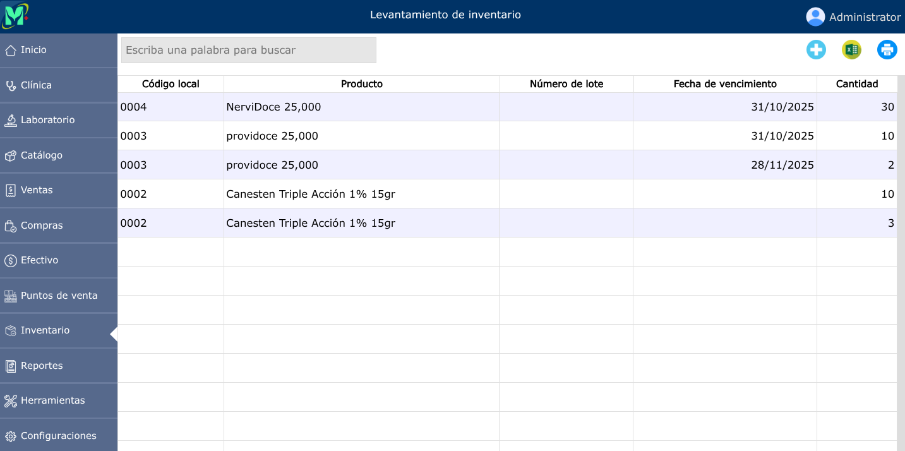
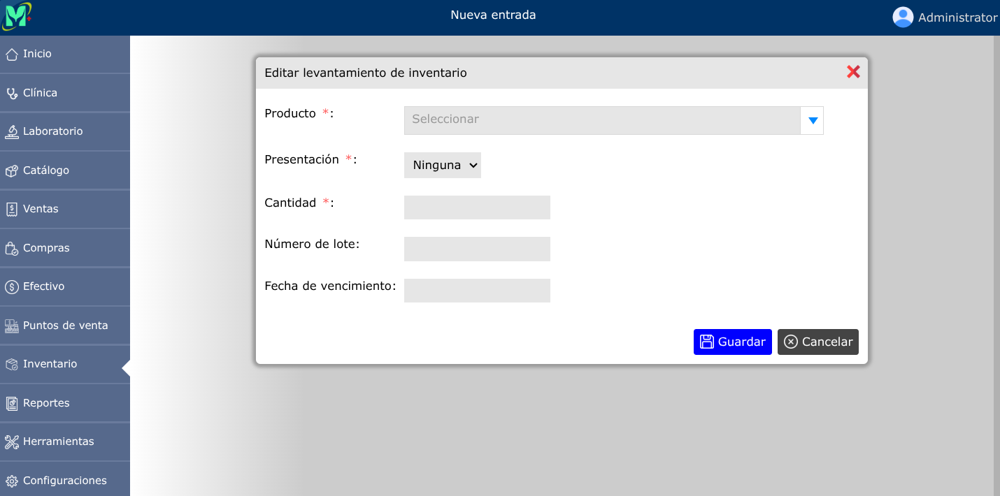
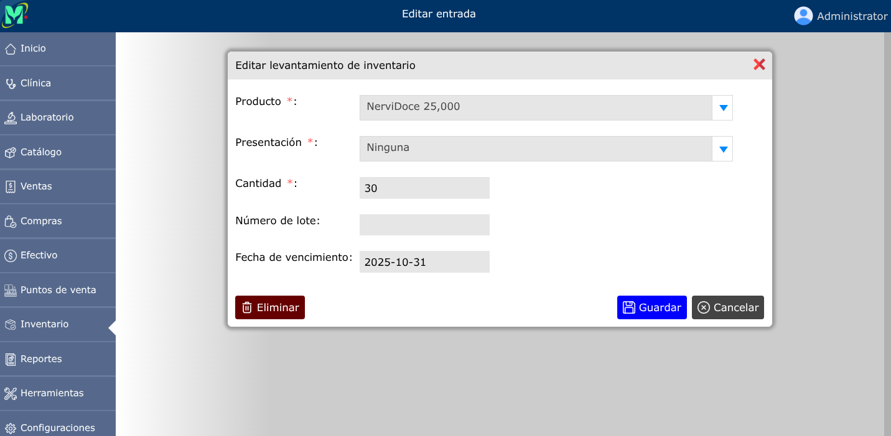

# Levantamiento de inventario

Proceso operativo que consiste en el conteo, verificación y registro físico de las existencias reales en almacén y cuadrar el stock real del almacén con el sistema.

---

## Listado de levantamientos de inventario

Para ver el listado de levantamientos de inventario, vaya a: **Inventario > Levantamiento de inventario**.

---

## Nuevo levantamiento de inventario

Para registrar un nuevo levantamiento de inventario, vaya a: **Inventario > Levantamiento de inventario**, y luego dar clic en el botón **+**.

---

## Listado de productos de un levantamiento de inventario

Para ver el listado de productos, vaya a: **Inventario > Levantamiento de inventario**, luego dar clic en el levantamiento de inventario registrado previamente.

---

### Nueva entrada dentro de un levantamiento de inventario

Para registrar una nueva entrada, vaya a: **Inventario > Levantamiento de inventario**, luego dar clic en el levantamiento que ha creado previamente y se mostrará una tabla en donde seguidamente dara clic en el botón **+**.

---

### Modificar entrada

Para modificar una entrada, vaya a: **Inventario > Levantamiento de inventario**, luego dar clic en el levantamiento en el cual desea modificar una entrada y se abrirá la vista detallada de la entrada en donde podrá modificar dicha entrada al haber finalizado dar clic en el botón **Guardar**.

---

### Eliminar entrada

Para eliminar una entrada, vaya a: **Inventario > Levantamiento de inventario**, luego dar clic en el levantamiento en el cual desea eliminar una entrada y se abrirá la vista detallada de la entrada, y al pie de esa vista, haga clic en el botón **Eliminar**.

