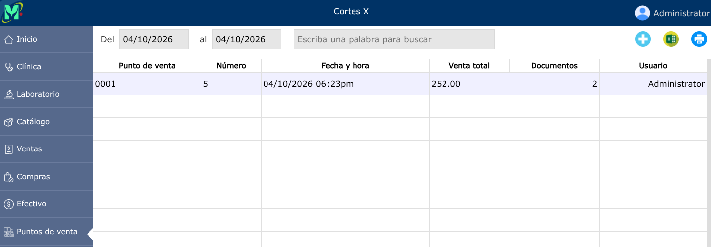
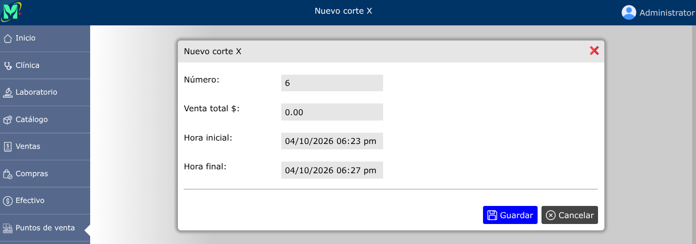
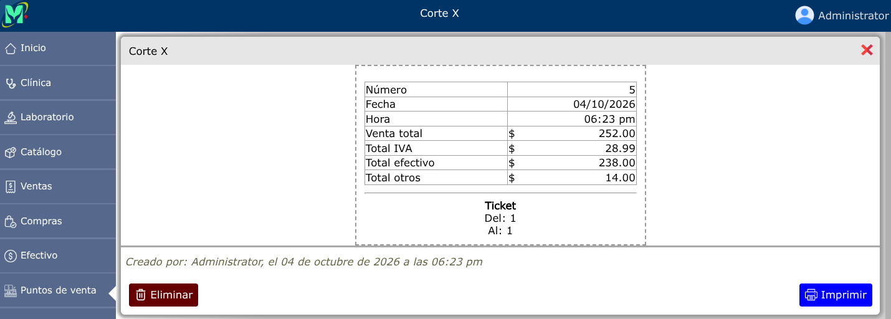

# Corte X

Reporte de lectura y auditoría parcial de caja que muestra el acumulado de las ventas y cobros realizados durante el turno o jornada activa sin cerrar la sesión ni poner en cero los contadores del sistema.

---

## Listado de cortes X

Para ver el listado de cortes X; vaya a: **Puntos de venta > Cortes X**.

---

## Nuevo corte X

Para registrar un nuevo corte X, vaya a: **Puntos de venta > Cortes X**, y luego dar clic en el botón **+**.

---

## Eliminar corte X

Para eliminar un corte X, vaya a: **Puntos de venta > Cortes X**, luego dar clic en el corte X registrado y se abrirá la vista detallada del corte X, y al pie de esa vista, haga clic en el botón **Eliminar**.

