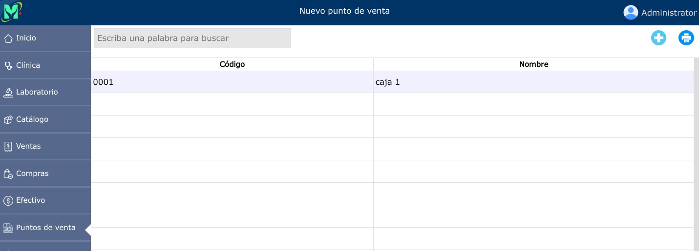
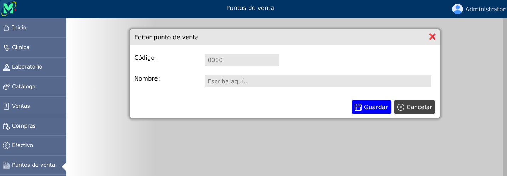
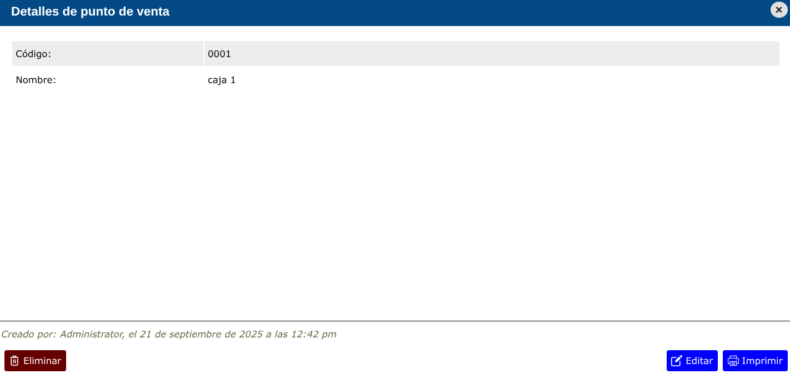

# Puntos de venta

Registro y control individual de cada equipo o estación de cobro habilitada en una sucursal.

---

## Listado de puntos de venta

Para ver el listado de puntos de venta, vaya a: **Puntos de venta > Puntos de venta**.

---

## Nuevo punto de venta

Para registrar un nuevo punto de venta, vaya a: **Puntos de venta > Puntos de venta**, y luego dar clic en el botón **+**.

---

## Editar punto de venta

Para editar un punto de venta, vaya a: **Puntos de venta > Puntos de venta**, luego dar clic en el punto de venta que desea editar, y se mostrará una vista en donde podrá observar la opción **Editar**.

---

## Eliminar punto de venta

Para eliminar un punto de venta, vaya a: **Puntos de venta > Puntos de venta**, luego dar clic en el punto de venta que desea eliminar, y se mostrará una vista en donde podrá observar la opción **Eliminar**.

