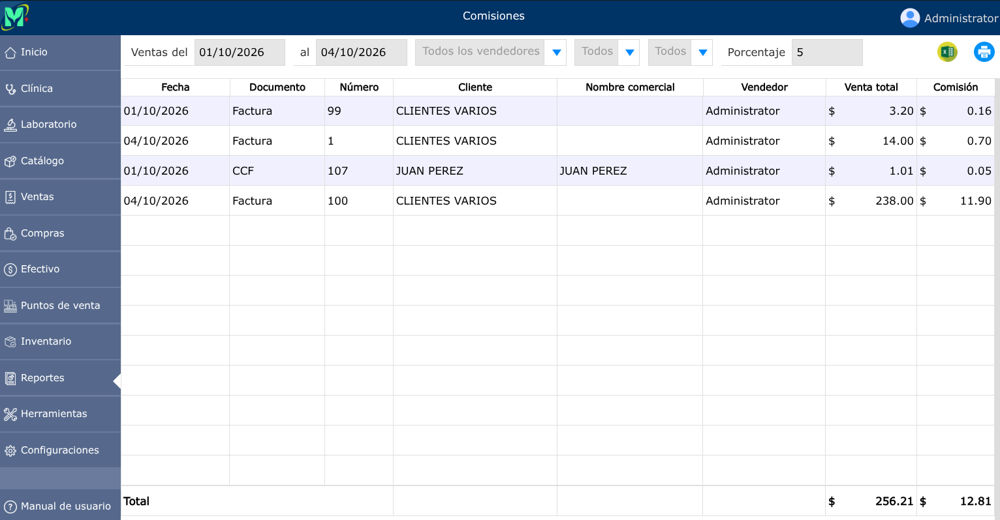

# Comisiones

Incentivo financiero calculado como un porcentaje o monto fijo atribuido a un vendedor, agente o colaborador por cada venta o transacción concreta.

---

## Reporte de comisiones

Para ver el reporte de comisiones, vaya a: **Reportes > Comisiones**.

Se mostrarán los siguientes selectores, en donde podrá generar el reporte por fechas específicas, por vendedor, seleccionar si esta pagado o pendiente, y por porcentaje.

