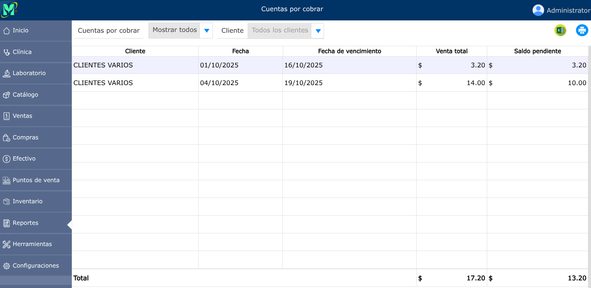

# Cuentas por cobrar

Registro financiero que consolida los saldos pendientes de pago a favor de la empresa, generados por ventas al crédito o prestación de servicios previamente facturados.

---

## Listado de cuentas por cobrar

Para ver el listado de cuentas por cobrar, vaya a: **Reportes > Cuentas por cobrar**.

En donde se mostrará un selector para ver las cuentas por cobrar, por créditos vencidos o vigentes, y un buscador para encontrar algun cliente.

