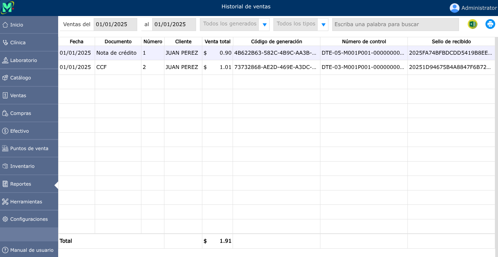

# DTE enviados

Los DTE enviados son todos los diferentes tipos de documentos legales que se envian al Ministerio de Hacienda.

---

## Historial de DTE enviados

Para ver el historial de DTE enviados, vaya a: **Reportes > DTE enviados**.

En el historial de DTE enviados, podrá descargar el reporte mensual para su respectiva declaración, en el cual podrá seleccionar el rango de fechas de **Ventas del ,al**. 

En la opción de **Todos los generados**, podrá seleccionar los DTE enviados y de igual manera los invalidados. Al haber seleccionado el rango de fechas y los DTE enviados o invalidados, podrá dar clic en el icono de Excel para descargar el reporte.

En el historial de DTE enviados, también podrá descargar el reporte únicamente de Facturas, CCF, Nota de crédito, Nota de débito.

Si durante el mes tuvo DTE invalidados, deberá descargar el reporte de DTE enviados y los invalidados.

