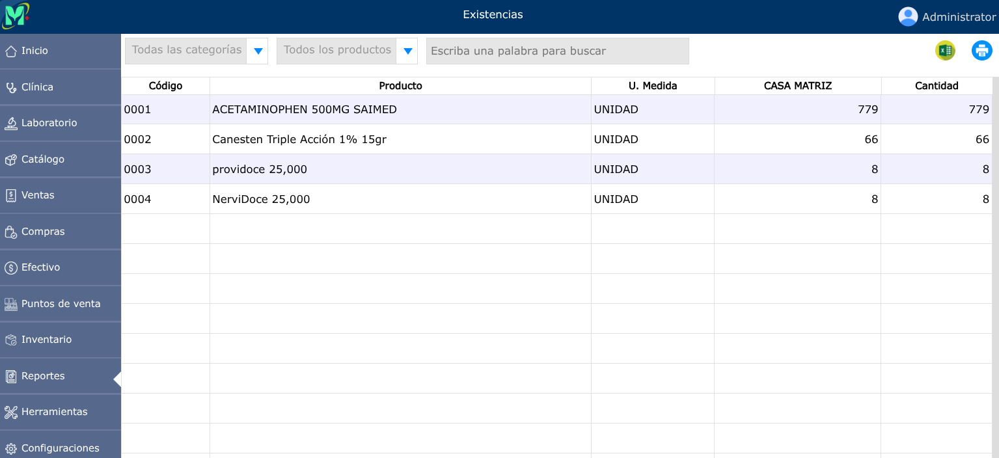

# Existencias

Indicador que representa la cantidad física y disponible de bienes, materias primas o productos que posee una empresa en sus almacenes en un momento determinado.

---

## Reporte de existencias

Para ver el reporte de existencias, vaya a: **Reportes > Existencias**.

Se mostrarán dos selectores en donde podrá generar el reporte por categoría y por productos con existencia, agotado o desactivado.

