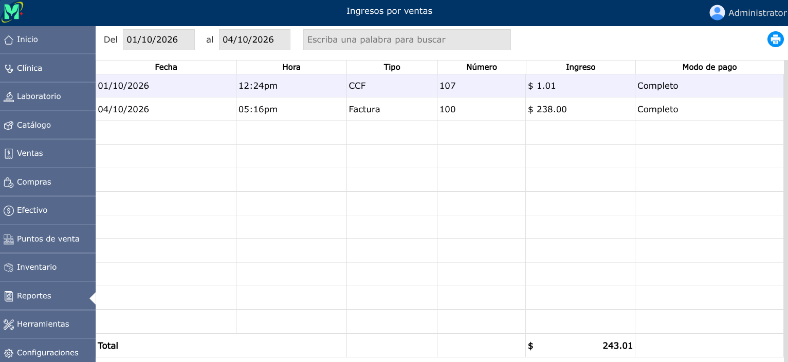

# Ingresos por ventas

Indicador financiero que representa el monto total acumulado por la venta de productos o la prestación de servicios durante un período determinado.

---

## Listado de ingresos por ventas

Para ver el listado de ingresos por ventas, vaya a: **Reportes > Ingresos por ventas**.

Se mostrará un selector de fechas en donde podrá generar el reporte de ingresos por fechas específicas.

