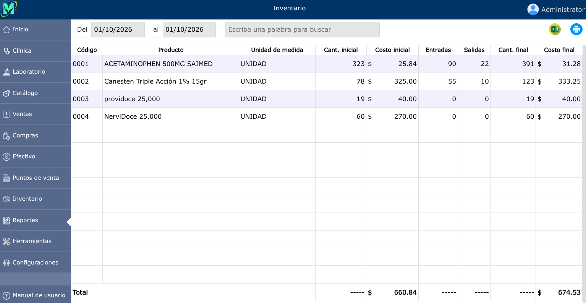

# Inventario

Registro que controla y audita la existencia física y disponible de los productos o materias primas. Almacena las cantidades actuales, ubicaciones en almacén, valores de costo, puntos de reorden y el historial de entradas y salidas.

---

## Reporte de inventario

Para ver el reporte de inventario, vaya a: **Reportes > Inventario**.

En donde podrá generar el reporte por fechas específicas, y si tiene varias sucursales podrá generar el reporte por sucursal.

