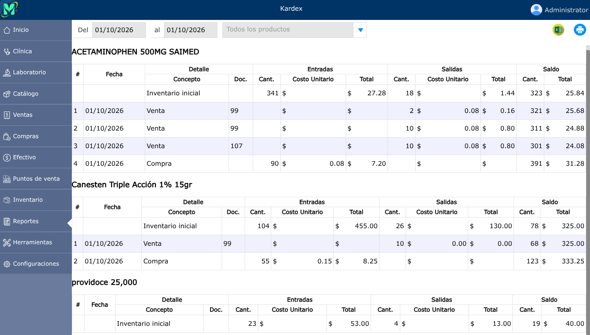

# Kardex

Registro cronológico e histórico que rastrea de manera detallada todos los movimientos de entrada, salida y saldo de un producto en el inventario.

---

## Listado de productos

Para ver el listado de productos, vaya a: **Reportes > Kardex**.

