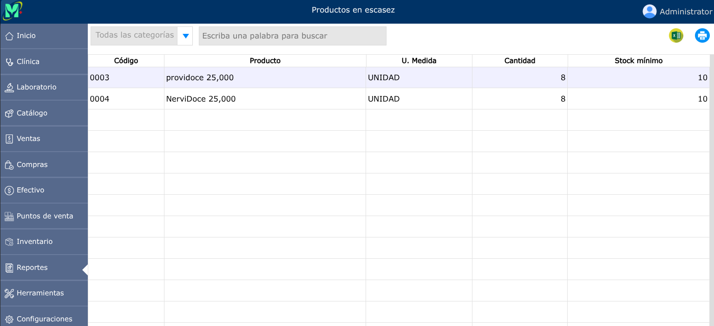

# Reporte de productos en escasez

El reporte de productos en escasez contiene una lista de productos cuyas existencias son menores al mínimo configurado para dicho producto.

---

## Reporte de productos en escasez

Para ver el reporte de productos en escasez, vaya a: **Reportes > Productos en escasez**.

Para configurar los límites mínimos de la existencia de productos, debe hacerlo desde la sección de [Productos](../catalogo/productos.md).

