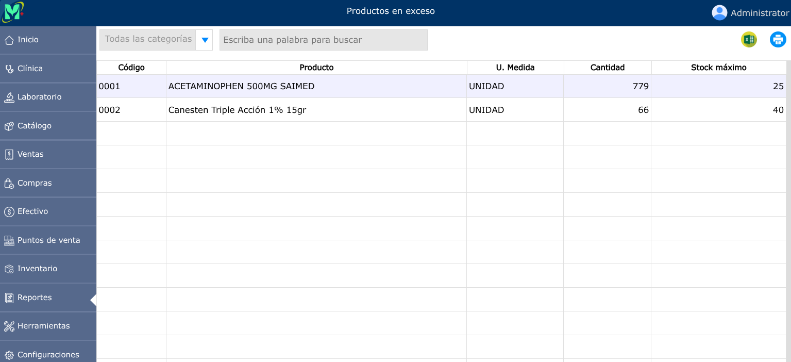

# Reporte de productos en exceso

El reporte de productos en exceso contiene una lista de productos cuyas existencias son mayores al máximo configurado para dicho producto.

---

## Reporte de productos en exceso

Para ver el reporte de productos en exceso, vaya a: **Reportes > Productos en exceso**.

Para configurar los límites máximos de la existencia de productos, debe hacerlo desde la sección de [Productos](../catalogo/productos.md).

