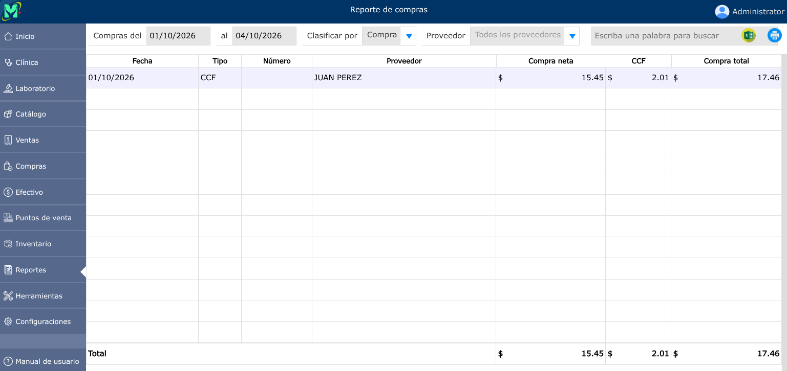

# Reporte de compras

Informe que resume las adquisiciones de productos o servicios, gastos por proveedores y recepciones de inventario en un período de tiempo.

---

## Reporte de compras

Para ver el reporte de compras, vaya a: **Reportes > Compras**.

En donde podrá generar el reporte de compras por fechas específicas, clasificarlo por compras, producto, día y por proveedor,.

