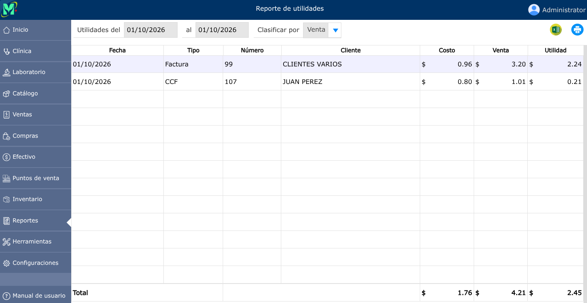

# Reporte de utilidades

Informe financiero que calcula y analiza la ganancia neta o bruta obtenida por la venta de bienes o servicios en un período determinado.

---

## Reporte de utilidades

Para ver el reporte de utilidades, vaya a: **Reportes > Utilidad**.

En donde podrá generar el reporte de utilidades por fechas específicas y clasificarlo por venta, producto y día.

