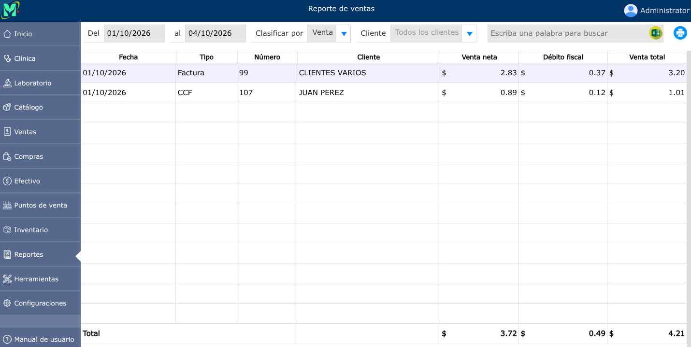

# Reporte de ventas

Informe que resume y analiza los ingresos, productos o servicios vendidos y transacciones comerciales registradas en un período de tiempo.

---

## Reporte de ventas

Para ver el reporte de ventas, vaya a: **Reportes > Ventas**.

