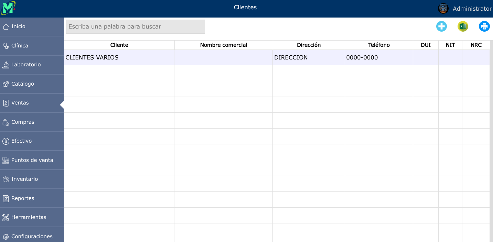
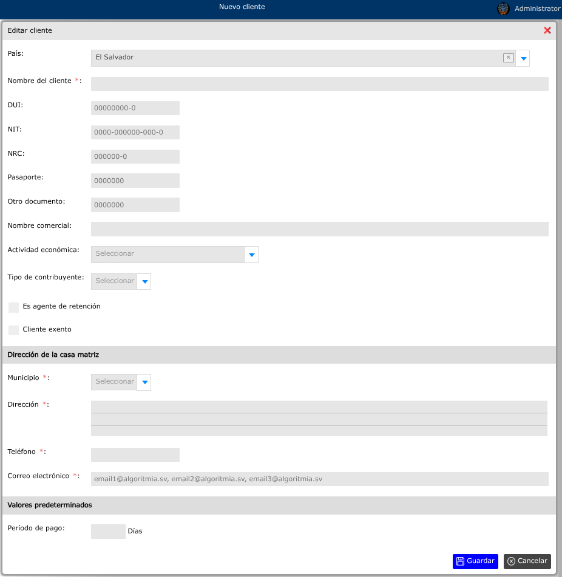
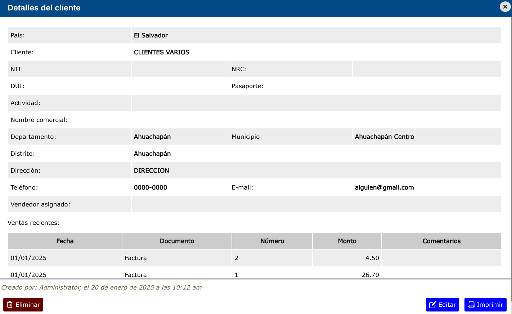

# Clientes

Este módulo permite registrar y gestionar cada uno de los clientes.

---

## Lista de clientes

Para ver la lista de clientes, vaya a: **Ventas > Clientes**.

Se mostrará un buscador en donde podrá buscar cualquier cliente.

---

## Crear nuevo cliente

Un cliente puede ser registrado desde tres ubicaciones: Desde el registro de clientes, desde el formulario de cotizaciones y desde el formulario de venta.

Para crear un nuevo cliente, vaya a: **Ventas > Clientes**, y luego dar clic en el botón **+**.

Todos los campos que aparezcan con el signo (*), es por que son campos que no pueden ir vacíos.

---

## Editar cliente

Para modificar un cliente, vaya a: **Ventas > Clientes**, luego dar clic en el cliente que desea modificar y se mostrará una vista en donde podrá observar la opción **Editar**.

---

## Eliminar cliente

Para eliminar un cliente, vaya a: **Ventas > Clientes**, luego dar clic en el cliente que desea eliminar y se mostrará una vista en donde podrá observar la opción **Eliminar**.

