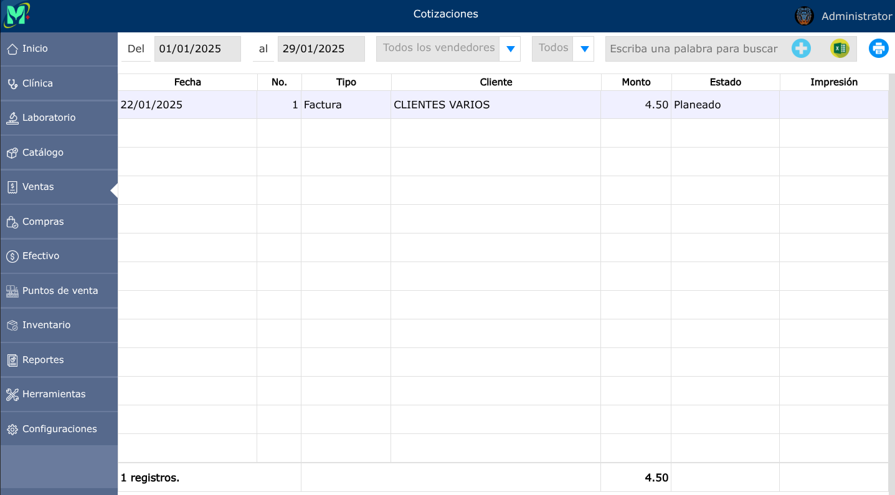
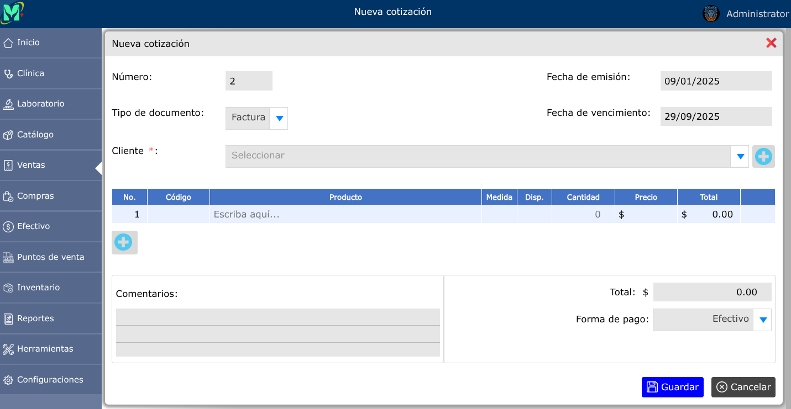
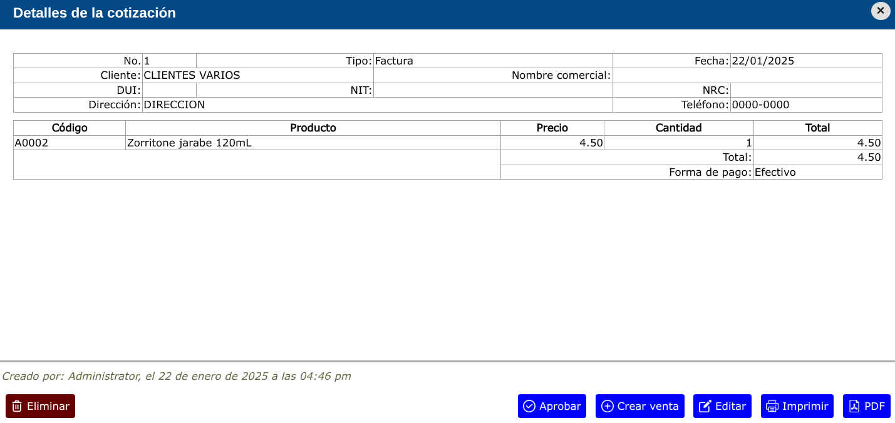

# Cotizaciones

---

## Lista de cotizaciones

Para ver la lista de cotizaciones, vaya a: **Ventas > Cotizaciones**.

---

En este apartado podrá filtrar las cotizaciones por fechas, vendedores o por estados ya sea planeado, aprobado, facturado o anulado.

---

## Nueva cotización

Para registrar una nueva cotización, vaya a: **Ventas > Cotizaciones**, y luego dar clic en el botón **+**.

---

## Editar cotización

Para poder editar una cotización, vaya a: **Ventas > Cotizaciones**, luego dar clic en la cotización que desea editar y se mostrará una vista en donde podrá observar la opción **Editar**.

---

## Eliminar cotización

Para poder eliminar una cotización, vaya a: **Ventas > Cotizaciones**, luego dar clic en la cotización que desea eliminar y se mostrará una vista en donde podrá observar la opción **Eliminar**.

---

## Crear venta de una cotización

Para crear una venta de una cotización, vaya a: **Ventas > Cotizaciones**, luego dar clic en la cotización que desea crear la venta y se mostrará una vista en donde podrá observar la opción **Crear venta**.

