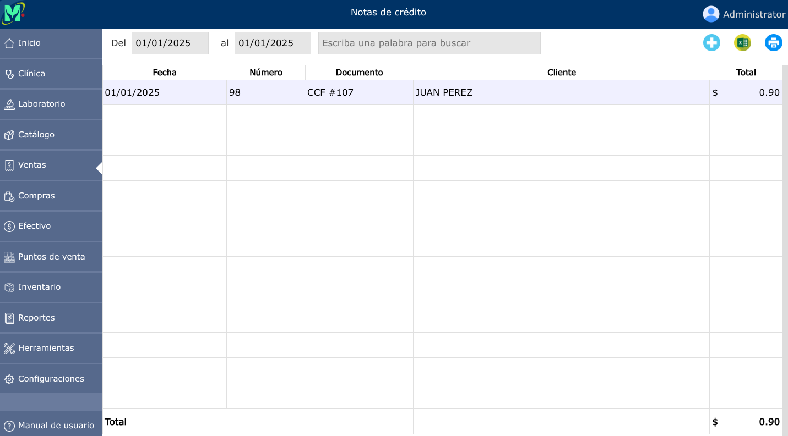

# Notas de crédito

Una nota de crédito es un documento comercial y legal enviado por el vendedor al comprador para anular, reducir o corregir el importe de una factura emitida anteriormente.

---

## Lista de notas de crédito

Para ver la lista de notas de crédito, vaya a: **Ventas > Notas de crédito**.

---

## Nueva nota de crédito

Para registrar una nueva nota de crédito, vaya a: **Ventas > Notas de crédito**, luego dar clic en el botón **+**, y luego dar clic en **seleccionar**, se mostrará una lista en donde deberá seleccionar la venta a la que desea crear la nota de crédito.

Luego de haber seleccionado la factura podrá dar clic en la opción **Continuar**

