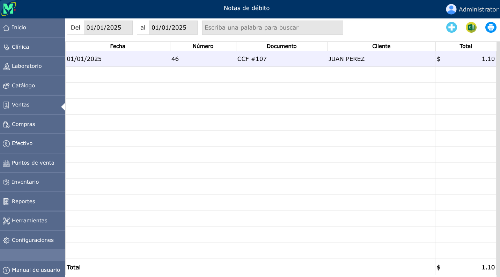
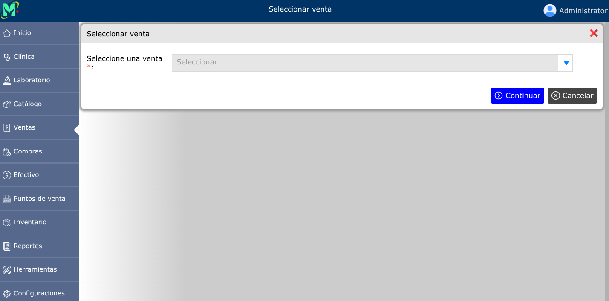
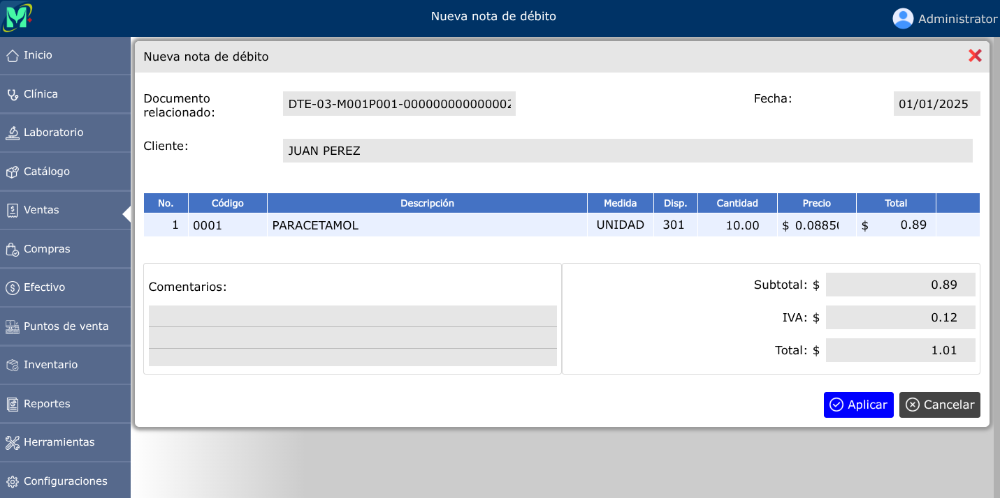

# Notas de débito

Una nota de débito es un documento comercial emitido por un vendedor a un comprador para notificarle que se ha incrementado su deuda. Se utiliza principalmente para ajustar facturas previas por errores, omisiones, intereses, por mora o cargos adicionales.

---

## Lista de notas de débito

Para ver la lista de notas de débito, vaya a: **Ventas > Notas de débito**.

---

## Nueva nota de débito

Para registrar una nueva nota de débito, vaya a: **Ventas > Notas de débito**, luego dar clic en el botón **+**, y luego dar clic en **seleccionar**, se mostrará una lista en donde deberá seleccionar la venta a la que desea crear la nota de débito.

Luego de haber seleccionado la venta podrá dar clic en la opción **Continuar**

