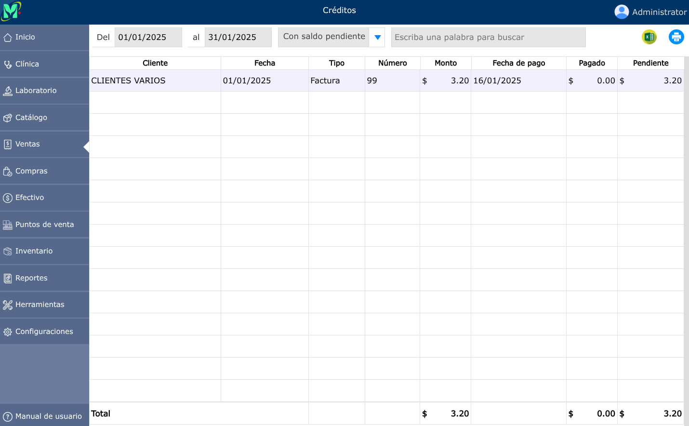
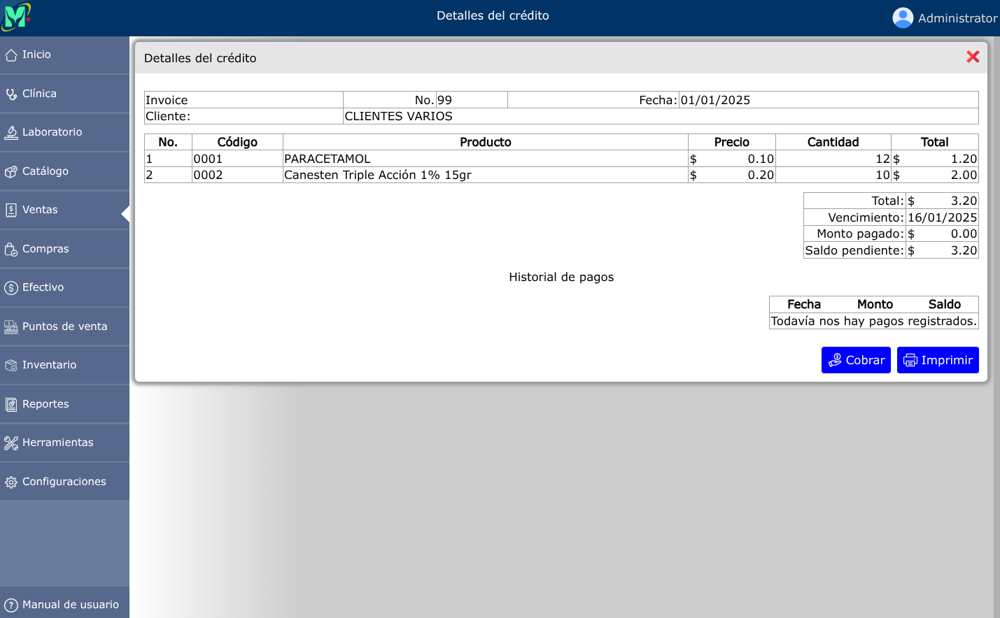
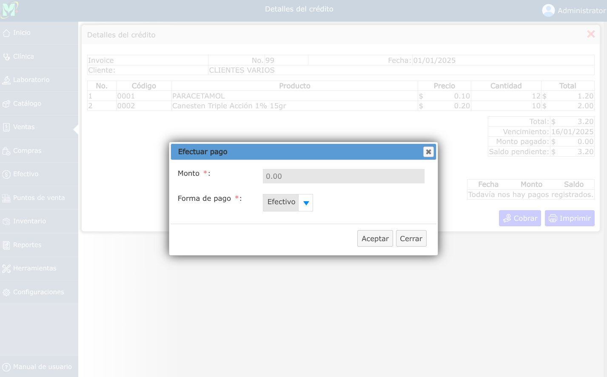

# Ventas al crédito

Transacción comercial cuyo pago se difiere a plazo, generando una cuenta por cobrar y un plan de cuotas para el cliente.

---

## Lista de ventas al crédito

Para ver la lista de ventas al crédito, vaya a: **Ventas > Ventas al crédito**.

Se mostrará un selector en donde podrá seleccionar las ventas al crédito con saldo pendiente, vencidos o pagados.

---

## Detalles del crédito

Para ver el detalle del crédito, vaya a: **Ventas > Ventas al crédito**, luego dar clic en el crédito que desea ver el detalle y se mostrará una vista en donde podrá observar el historial de los abonos que se han ido realizando en ese crédito.

---

## Cobrar crédito

Para cobrar un crédito, vaya a: **Ventas > Ventas al crédito**, luego dar clic en el crédito que desea cobrar y se mostrará una vista en donde se podrá observar la opción **Cobrar**.

