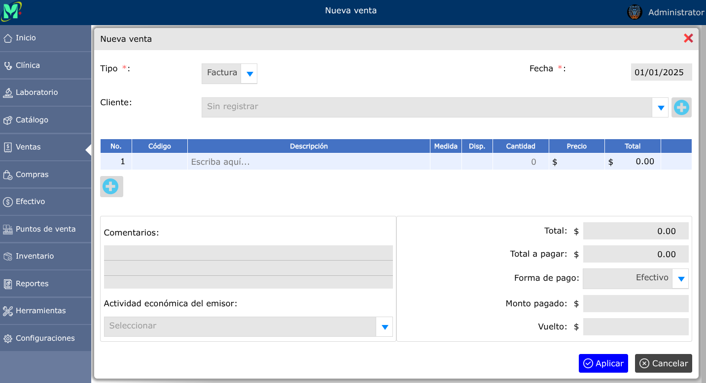
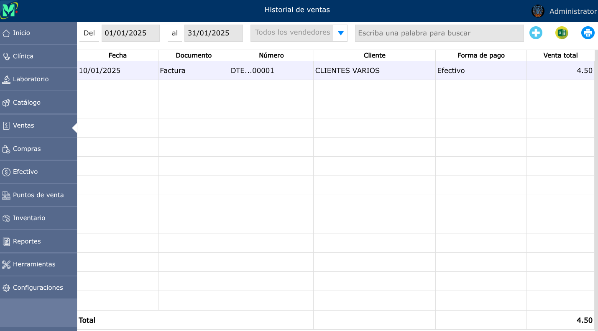
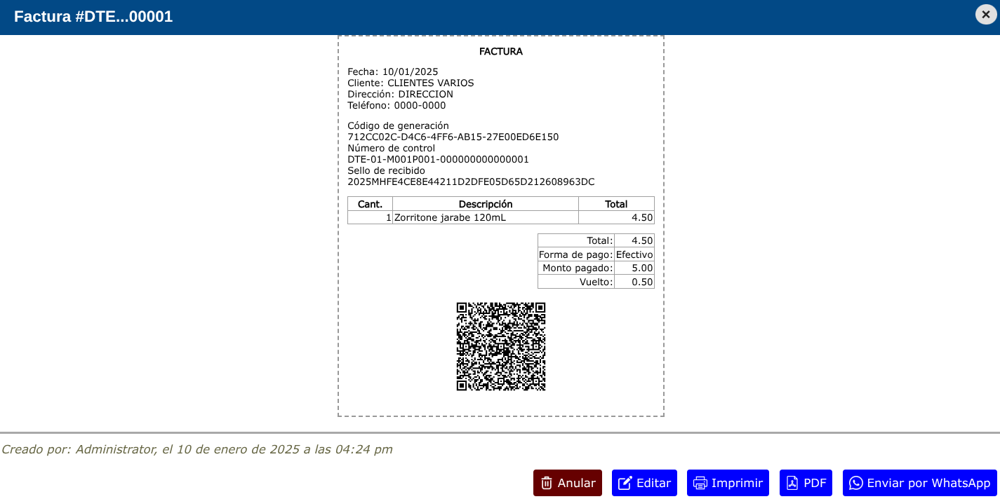

# Ventas

Las ventas son las transacciones comerciales que detallan los productos o servicios adquiridos, el monto cobrado y el comprobante generado.

---

## Nueva venta

Para ingresar al módulo de ventas, vaya a: **Ventas > Nueva venta**.

En donde podrá observar los siguientes selectores:

**Tipo:** en este apartado podrá seleccionar que tipo de documento desea transmitir ya sea una Factura o Crédito fiscal.

**Cliente:** en este apartado deberá seleccionar al cliente que desea transmitir dicho documento.

**Descripción:** en este apartado deberá dar clic y luego podrá escribir dicho producto o servicio que desea vender.

**Forma de pago:** en este apartado podrá seleccionar la forma de pago de dicha venta ya sea en efectivo o al crédito.

**Monto pagado:** en este apartado deberá escribir con cuanto le esta pagando dicho cliente.

---

## Historial de ventas

Para ver el historial de ventas, vaya a: **Ventas > Historial de ventas**.

En este apartado podrá seleccionar el historial de ventas ya sea por día, semana o mes y cuales ventas fueron generadas por cada uno de los usuarios.

Desde el historial de ventas también podrá generar una nueva venta, para esto deberá dar clic en el botón **+**, que aparece en la parte derecha de arriba.

---

### Anular Venta

Para anular una venta, vaya a: **Ventas > Historial de ventas**, luego dar clic en la factura o Crédito fiscal que desea eliminar y se mostrará una vista en donde podrá observar la opción **Anular**.

